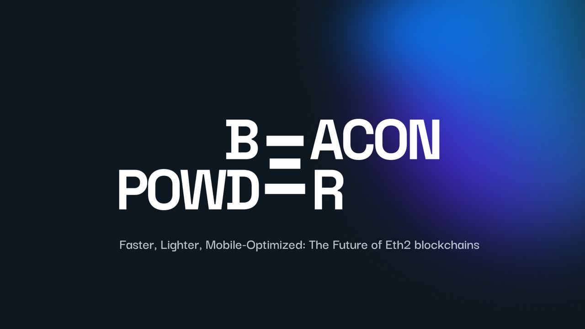

<p align="center">

</p>
<p align="center">
</p>

# B𝕖𝕒c𝕠n P𝕠wd𝕖r

Beacon Powder is a proof of concept of rapid development of blockchain consensus verification based on zero-knowledge proofs.
The main feature is the use of [powdr](https://github.com/powdr-labs/powdr) framework to compile the state transition code written
in an imperative language directly into a ZK circuit that could be used by a light client to trustlessly verify
all the information it receives.

## Project status

At this stage the prototype does not verify the full state transition.
To show off the capability we focused on verifying the BLS signatures in consensus blocks, which is one of the more challenging
elements when building such circuits by hand.

The project was meant support many different consensus protocols, including those used by Aleph Zero and Celo, but currently
the repository only provides a prototype targeting the Ethereum's beacon chain.

## How to use

### Dependencies

The project requires a recent nightly version of Rust, which can be obtained via `rustup`:
```bash
rustup toolchain install nightly-2023-08-03-x86_64-unknown-linux-gnu
rustup component add rust-src --toolchain nightly-2023-08-03-x86_64-unknown-linux-gnu

# optional
rustup component add rust-analyzer --toolchain nightly-2023-08-03-x86_64-unknown-linux-gnu
```

### Building the circuits

#### Prerequisites

Clone the project:
```
git clone https://github.com/HappyZKFriends/bcn-powdr
```

#### Compiling the circuits

- Install PILCOM

    ```bash
    git clone https://github.com/0xPolygonHermez/pilcom.git
    cd pilcom
    npm install
    ```

- Compile the circuit

    ```bash
    cd bcn-powdr
    PILCOM=$(PATH_TO_PILCOM)/pilcom/ cargo run --all-features zk-verifier run
    ```

    TODO: Unfinished, only compiles the `arith384.asm` example for now.

#### Generating the proofs

TODO: Unfinished

#### Verifying the proofs

TODO: Unfinished
